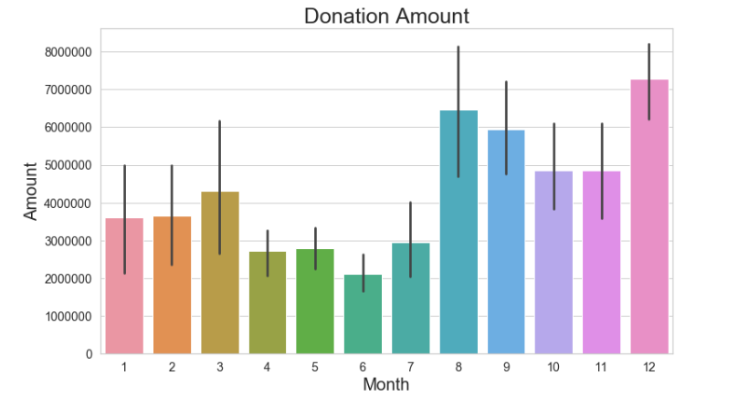

# Tiny But Mighty Feline Rescue Non-Profit

### Data Selection
This dataset is for a fictional non-profit organization and my goal was to gauge the health of the organization and to come up with a way to increase future donations.  This was achieved by looking at historical donation amounts and I then came up with a way to increase future donations by  creating a "suggested" future amount based on how much was donated in the past.

### Visualization
Bar graphs were used to simply and quickly show the donation amounts by year and month.

## Tools Used
* **Pandas** for data cleaning and analysis.

## Project Screenshots

### Monthly Donation Amount

